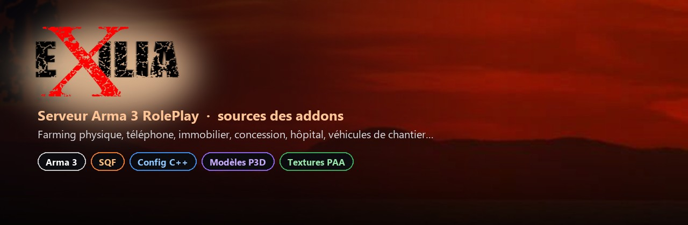
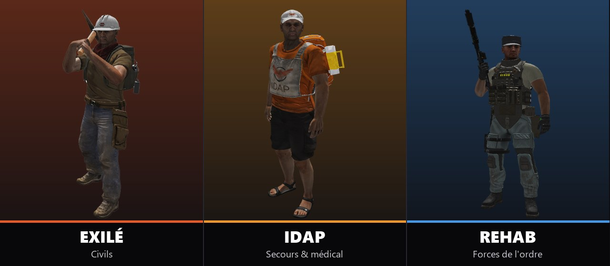
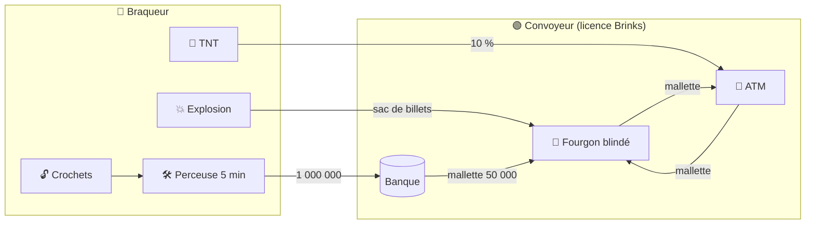
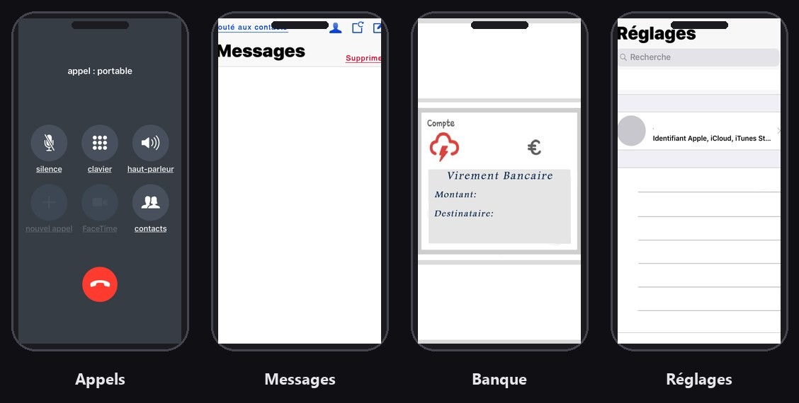
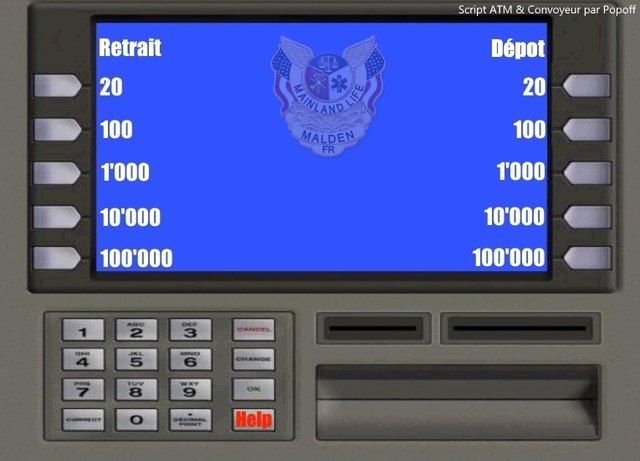
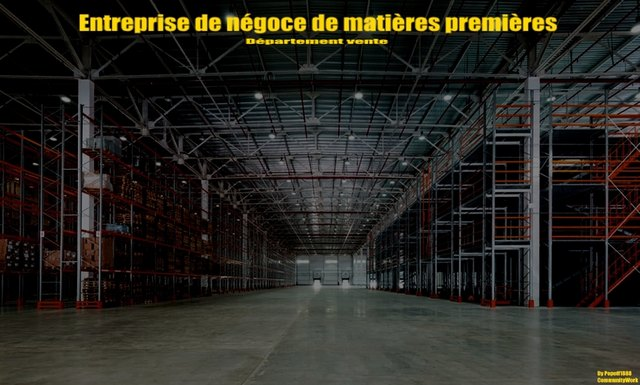
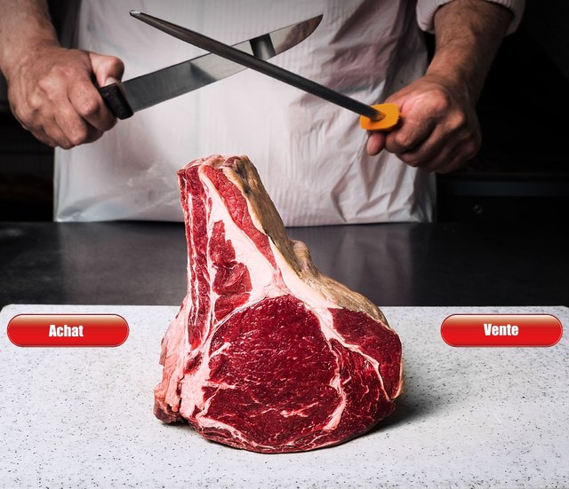
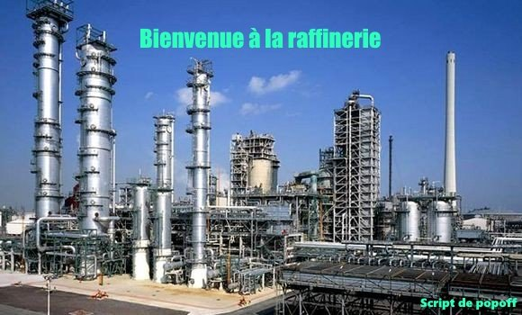
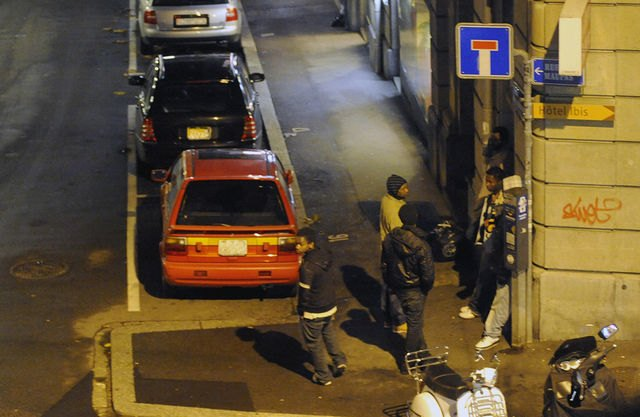
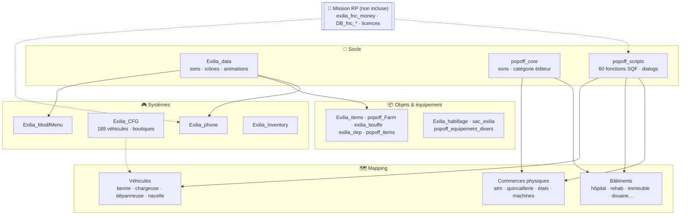

<div align="center">



<br/>


**Sources des addons du serveur Arma 3 RolePlay français _Exilia_** : modèles 3D, textures, configs et scripts SQF.
On y trouve une économie jouable (banque, convoyeurs de fonds, braquages, négoce), un smartphone en jeu, une concession de 188 véhicules, un hôpital, un commissariat, des véhicules de chantier…

[Factions](#-les-trois-factions) · [Fonctionnalités](#-fonctionnalités) · [Interfaces](#%EF%B8%8F-interfaces-en-jeu) · [Architecture](#%EF%B8%8F-architecture) · [Addons](#-les-49-addons) · [Compilation](#-compiler-les-addons) · [À corriger](#-points-connus--à-corriger) · [Crédits](#-crédits--licences)

</div>

---

## 👥 Les trois factions



Le lobby multijoueur est remplacé par trois gros boutons de camp (addon `Exilia_ModifMenu`) :

| Faction | Camp Arma | Rôle | Progression |
|---|---|---|---|
| **EXILÉ** | `civilian` | Civils : métiers, entreprises, commerce… et hors-la-loi | licences (`License_civ_*`) |
| **IDAP** | `independent` | Secours et médical (numéro **18**) | `Exilia_mediclevel` |
| **REHAB** | `west` | Forces de l'ordre / shérif (numéro **17**) | `Exilia_coplevel` |

---

## ✨ Fonctionnalités

### 💶 Économie, banque et convoyeurs de fonds
Addons `popoff_scripts`, `atm_popoff` et `fourgon_charliepopoff`.

- **Distributeurs (ATM)** :
  - chaque ATM a sa propre réserve de billets, tirée entre 10 000 et 500 000 au premier accès ;
  - retrait ou dépôt de 20, 100, 1 000, 10 000 ou 100 000, dans la limite d'un million ;
  - un ATM peut être « hors service ».
- **Convoyeurs de fonds** (licence `License_civ_brinks`) :
  - ouvrir un ATM, recharger ou décharger des **mallettes de 50 000** ;
  - porter la mallette à la main et remplir le fourgon blindé, dont la jauge est animée ;
  - le niveau de billets est visible sur le modèle de l'ATM.
- **Braquages** :
  - **ATM** : TNT avec compte à rebours, puis 10 % du contenu ;
  - **fourgon** : explosion, puis un sac de billets à récupérer ;
  - **mallette** : fracture risquée, 95 % de chances d'une fumée violette ;
  - **guichet** : 15 000 et une alarme ;
  - **banque** : crochetage des grilles et des portes, perceuse posée sur le coffre (5 min de perçage), puis **1 000 000**.



### ⛏️ Farming physique et négoce
Addons `popoff_Farm`, `shop_farm_physique_popoff`, `transfo_farm_physique_popoff`, `quincaillerie_popoff` et `popoff_scripts`.

- **Les stocks sont visibles** : étals, palettes, lingots et casiers se remplissent ou se vident sur les modèles 3D selon la quantité (**107 présentoirs animés**).
- **Négoce de matières premières** (quincaillerie) : achat et vente de lingots, avec un stock partagé par boutique.

  | Lingot | Achat | Vente | Stock max |
  |---|---:|---:|---:|
  | Fer | 150 | 160 | 1 000 |
  | Cuivre | 180 | 160 | 1 000 |
  | Argent | 150 | 160 | 1 000 |
  | Plastique | 130 | 150 | 1 000 |
  | Or | 17 550 | 21 750 | ~20 |

- **Boucherie** : dépeçage des vaches (5 steaks crus), achat et vente de viande.
- **Transformation** : le broyeur transforme 5 pierres en 1 sac de ciment. D'autres machines sont prévues : usinage, scierie, broyeur de voitures.
- **65 objets de récolte** : légumes, 8 poissons, charbon, soufre, diamant, bûches, drogues, nourriture et 18 pièces d'armes.

### 📱 Smartphone en jeu
Addon `Exilia_phone`.



- **Appels entre joueurs** : clavier, états (demande, en cours avec chronomètre, refus, fin) et **appel masqué** avec `#31#`.
- **Numéros spéciaux** :
  - **17** : police (REHAB) ;
  - **18** : secours (IDAP) ;
  - **12** : dépanneur ;
  - **22** : administrateurs.
- **Applications** : SMS et contacts (indicateur en ligne ou hors ligne), virements bancaires, bourse, carte, synchronisation, réglages.
- **Personnalisation** : **16 fonds d'écran**, **15 sonneries** (Nokia 3310, Tetris…), 3 notifications. La position du téléphone est mémorisée dans le profil.
- Les sonneries sont des sons 3D audibles par les joueurs proches.

### 🚗 Concession : 188 véhicules configurés
Addon `Exilia_CFG`.

| Catégorie | Nb | Fourchette de prix |
|---|---:|---|
| Civil : démarrage | 7 | 2 107 → 9 508 |
| Civil : voitures | 51 | 11 999 → 109 863 |
| Civil : luxe | 53 | 58 600 → 607 545 |
| Civil : collection | 21 | 82 000 → 496 777 |
| Civil : camionnettes | 17 | 22 089 → 85 598 |
| Civil : poids lourds | 32 | 61 000 → 1 347 856 |
| Civil : aérien | 1 | 22 967 |
| IDAP | 2 | 22 967 → 43 568 |
| REHAB | 4 | 22 967 → 129 450 |

Chaque véhicule `EXILIA_*` définit son prix, sa charge, sa vitesse, son réservoir et **61 teintes et camos**. Les boutiques sont réparties par faction (civil, entreprises, gouvernement, IDAP, REHAB, **marché noir**), avec des niveaux d'accès. Le fichier `chargeObjects` définit les positions de chargement de cartons, barils et caisses de TNT sur **140 plateaux**.

### 🏢 Bâtiments enterables

| Bâtiment | Points forts |
|---|---|
| 🏥 **Hôpital** (`exilia_hopital`) | 42 portes, dont 8 de garage ; annexe ; lit d'hôpital « véhicule » (`popoff_lithopital`) |
| 🚔 **REHAB** (`exilia_rehab`) | 18 portes (armurerie, cellules, salle d'interrogatoire, sans tain), **lecteur de badge** et **sas** scriptés |
| 🏙️ **Immeuble** (`appartement_exilia`) | Étages, toit, parking, **cage d'ascenseur de 60 m**, volets roulants, compteur électrique |
| 🛂 **Douane** (`douane_popoff`) | Guérite avec barrières, lumières et alarme ; bureau avec cellules |
| 🔧 **Garage** (`exilia_garage`) | Garage de réparations, portes animées |
| 🔫 **Armurerie** (`armurerie_exilia`) | 10 coffres animés |
| 🚘 **Concessions** (`concession`, `exilia_concess`) | 17 portes, PC d'accès qui déverrouille le garage, monte-charge |
| ⚛️ **Centrale** (`exilia_centrale`) | Fosse du réacteur avec sas haute sécurité, **sirène d'alerte nucléaire** sur 10 km |
| 🕳️ **Égouts** (`exilia_egouts`) | 11 modules : droits, virages, jonctions en T |
| 🌉 **Voirie** | Ponts d'autoroute, pont-levis, parkings souterrains, feux tricolores, parcmètres, WC publics |

### 🚜 Véhicules et outils spéciaux

- **Camion benne MAN** (21 animations de benne) et **chargeuse à godet**, dans la faction « Exilia – véhicules exclusifs ».
- **Dépanneuse** sur base HMMWV : grue et plateau, gyrophares, 24 animations d'équipage.
- **Hélitreuillage** : depuis l'hélicoptère IDAP, les touches Page Suivante / Précédente déroulent une **nacelle de secours** jusqu'à 40 m pour évacuer des blessés.
- **Bateau de pêche** en versions civile, secours et police.

### 🎒 Objets, tenues et équipement

| Contenu | Nb |
|---|---:|
| Tenues personnalisées (`Exilia_habillage`) | 63 uniformes, 4 gilets pare-balles |
| Nourriture et boissons, avec faim et soif (`exilia_bouffe`) | 44 |
| Objets de récolte et de trafic (`popoff_Farm`) | 65 |
| Objets de mission, téléphones, cartes (`Exilia_items`) | 22 |
| Pièces de dépannage (`exilia_dep`) | 9 |
| Sacs (médic IDAP, exosquelette de 1 500, sacs de golf et de sport) | 11 |
| Marqueurs de carte : lieux, ressources, Defcon (`Exilia_markers`) | 88 |

### 🎬 Menu principal et animations
- Menu principal et lobby entièrement **re-skinnés** aux couleurs d'Exilia, avec un bouton « Entrer sur Exilia ».
- Gestes `Exilia_Restrain` (menotté) et `Exilia_Surrender` (reddition).
- Catégories d'éditeur 3DEN « Exilia » et « Popoff » pour placer tout le mapping.

---

## 🖥️ Interfaces en jeu

<table>
  <tr>
    <td width="50%"><p align="center"><b>Distributeur : retrait / dépôt</b></p></td>
    <td width="50%"><p align="center"><b>Négoce de matières premières</b></p></td>
  </tr>
  <tr>
    <td width="50%"><p align="center"><b>Boucherie : achat / vente</b></p></td>
    <td width="50%"><p align="center"><b>Raffinerie</b></p></td>
  </tr>
  <tr>
    <td width="50%"><p align="center"><b>Dealer</b></p></td>
    <td width="50%"><p align="center"><b>Vente de matériaux</b></p></td>
  </tr>
</table>

<sub>Ces images sont les vraies textures d'interface présentes dans les addons (`Exilia_data`, `popoff_scripts`, `atm_popoff`, `Exilia_phone`).</sub>

---

## 🏗️ Architecture

Les addons se répartissent en quatre familles. Deux socles communs, `Exilia_data` et `popoff_core`, fournissent sons, textures, icônes et catégories d'éditeur.



### Dépendances externes
Ces mods ne sont **pas inclus** dans ce dépôt :

| Dépendance | Utilisée par |
|---|---|
| **CBA_A3** | `popoff_Farm`, `popoff_items`, `exilia_dep` |
| **ACE3**, **Task Force Radio** | configuration de mission de référence (`Exilia_markers/data/mrk/configs`) |
| Packs de véhicules **D3S**, **Jonzie**, V12, KAMAZ, **Charlieco89** (`chVario_*`)… | `Exilia_CFG`, `fourgon_charliepopoff` |
| `UMI_Inventory`, `braquage`, `hafm_arma2_vehicles`, `tas_sol`, `bart_chapeaux` | modèles et objets référencés mais absents |
| **Mission RP** de type Altis Life (`exilia_fnc_money`, `DB_fnc_msgRequest`, `SOCK_fnc_syncData`, licences…) | `popoff_scripts`, `Exilia_phone` |

---

## 📦 Les 49 addons

<details>
<summary><b>🧱 Socle et systèmes (9)</b></summary>

| Addon | Rôle |
|---|---|
| `Exilia_data` | Sons, animations (menotté, reddition), icônes ACE, textures d'interface, catégories d'éditeur |
| `popoff_core` | Sons du projet (monte-charge, alerte nucléaire, perceuse…) et catégorie d'éditeur « Popoff » |
| `popoff_scripts` | **Cœur du gameplay** : 60 fonctions SQF (ATM, convoyeurs, braquages, négoce, boucherie, sas, monte-charge, hélitreuillage) et 4 dialogs |
| `Exilia_CFG` | 188 véhicules, boutiques par faction, positions de chargement |
| `Exilia_phone` | Smartphone : appels, SMS, banque, bourse, carte, réglages |
| `Exilia_ModifMenu` | Menu principal et lobby à 3 factions |
| `Exilia_Inventory` | Crochet de double-clic sur l'inventaire (squelette) |
| `Exilia_markers` | 88 marqueurs de carte, plus une config de mission de référence |
| `Boxes_Arsenal` | Caisses donnant accès à l'Arsenal BIS |

</details>

<details>
<summary><b>📦 Objets et équipement (11)</b></summary>

| Addon | Rôle |
|---|---|
| `Exilia_items` | 22 objets : contrebande, téléphones, cartes de crédit et d'accès |
| `Exilia_objects` | Places de parking (voiture, bateau), vignes |
| `Exilia_Immo` | Pancarte immobilière à 8 zones de texte, caméra dôme |
| `Exilia_habillage` | 63 tenues, 4 gilets pare-balles |
| `popoff_Farm` | 65 objets de récolte, pêche, drogues, nourriture, pièces d'armes |
| `popoff_Farm_mapping` | 18 sols de mapping (asphalte, cailloux, herbe…) |
| `popoff_items` | Perceuse, crochets, TNT de braquage |
| `popoff_equipement_divers` | Casques, Stetson, gilets, sacs de golf et de sport, holster |
| `exilia_bouffe` | 44 aliments et boissons (faim et soif) |
| `exilia_dep` | 9 pièces de dépannage (piston, roues, bougie…) |
| `sac_exilia` | Sacs médic IDAP (dont un brancard) et exosquelette |

</details>

<details>
<summary><b>🏢 Bâtiments et mapping (21)</b></summary>

| Addon | Rôle |
|---|---|
| `appartement_exilia` / `appartement_exilia2` | Immeuble d'habitation : étages, ascenseur, parking, volets |
| `armurerie_exilia` | Armurerie à 10 coffres |
| `concession` | Concession automobile **(FusioH, voir licence)** |
| `exilia_concess` | Concession Popoff avec monte-charge |
| `exilia_hopital` | Hôpital (42 portes) et annexe |
| `exilia_rehab` | Poste REHAB : badge, sas, cellules |
| `douane_popoff` | Guérite et bureau des douanes |
| `exilia_garage` | Garage de réparations |
| `exilia_centrale` | Fosse du réacteur et annexe |
| `exilia_egouts` | Réseau d'égouts modulaire (11 pièces) |
| `exilia_batiments_publics` | WC publics |
| `exilia_infrastructure` | Feux tricolores, feux piétons, parcmètre |
| `exilia_infrastructure_routiere` | Ponts d'autoroute, pont-levis, parkings souterrains |
| `digicode` | Digicodes et obstructions visibles ou invisibles |
| `atm_popoff` | ATM, abri ATM, guichet, mallette |
| `quincaillerie_popoff` | Négoce de matières premières |
| `shop_farm_physique_popoff` | 107 étals et présentoirs à stock animé |
| `transfo_farm_physique_popoff` | Broyeur à béton, usinage, scierie, broyeur de voitures |
| `objets_simple_popoff` | Fissure de route, sac de billets, portique, fondation |
| `popoff_fondation` | Dalle de fondation |

</details>

<details>
<summary><b>🚜 Véhicules (8)</b></summary>

| Addon | Rôle |
|---|---|
| `exilia_benne` | Camion benne MAN |
| `exilia_chargeuse` | Chargeuse à godet |
| `exilia_depanneuse` | Dépanneuse sur base HMMWV (config binarisée) |
| `fourgon_charliepopoff` | Actions du fourgon blindé et du poids lourd Brinks |
| `popoff_nacelle` | Nacelle d'hélitreuillage (config binarisée) |
| `popoff_lithopital` | Lit d'hôpital, sous forme de véhicule immobile |
| `bateau_peche_exilia` | Bateau de pêche civil, secours et police |
| `excavateur_exilia` | Emplacement de l'excavateur (contient encore l'exemple BI Test_Tank_01) |

</details>

---

## 🔨 Compiler les addons

Chaque dossier racine est **un addon**, qui devient un PBO. Le préfixe est donné par `$PREFIX$` ou `$PBOPREFIX$` quand ces fichiers existent, sinon c'est le nom du dossier.

1. Installer **Arma 3 Tools** (Steam), ou **Mikero Tools** (`pboProject`).
2. Monter le lecteur de travail `P:` et y copier les dossiers, pour que les chemins `\Exilia_data\...` et `\popoff_core\...` se résolvent.
3. Binariser et empaqueter chaque dossier dans `@Exilia\addons\` :
   ```bat
   pboProject -P "P:\Exilia_data"
   ```
   ou, avec Addon Builder : *Source* = le dossier, *Destination* = `@Exilia\addons`, et cocher **Binarize**.
4. Signer les PBO (`DSSignFile`) et déployer la clé `.bikey` sur le serveur.

> ℹ️ `exilia_depanneuse`, `exilia_infrastructure_routiere`, `popoff_nacelle` et `exilia_egouts` n'ont qu'un `config.bin` actif. Plusieurs configs portent l'en-tête « DeRap: mikero » : elles ont été **dé-binarisées** depuis des PBO.

---

## 🐞 Points connus / à corriger

L'analyse complète du code a relevé ces points :

**Économie et sécurité**
- [ ] **Aucune validation côté serveur** : tous les gains (ATM, braquages, négoce) sont crédités sur le client, sans `remoteExec` vers le serveur.
- [ ] **Arbitrage infini** sur le fer, l'argent, le plastique et surtout l'**or**, qui se revend 4 200 de plus qu'il ne s'achète.
- [ ] Double débit ou crédit probable dans `fn_achat_cuivre.sqf` et `fn_vente_boucherie.sqf` : `exilia_cash` est modifié en plus de l'appel à `exilia_fnc_money`.
- [ ] `fn_couperalarme` remet `braco_en_cours` à `true` au lieu de `false`.

**Scripts**
- [ ] Fonctions appelées mais non déclarées : `popoff_fnc_atmHelp` et `Popoff_fnc_broyeur_beton`.
- [ ] `setVariable` non publics sur des ATM et des fourgons partagés entre joueurs.
- [ ] `Boxes_Arsenal` ajoute un Arsenal **illimité** et utilise `player`, qui n'existe pas sur un serveur dédié.

**Configs**
- [ ] `CfgPatches` en conflit : `Popoff_creation` est déclaré dans **14 addons**, `popoff_man_AddOn_Cars` dans 2 et `Item_popoff` dans 2 ; la classe `fondation_1` est définie deux fois.
- [ ] `Exilia_CFG` hérite de packs de véhicules tiers sans les déclarer dans `requiredAddons`.
- [ ] Icônes de `exilia_dep` cassées (`\tex\` au lieu de `\textures\`) ; `animPeriod = 0,1` invalide dans `exilia_chargeuse`.
- [ ] `excavateur_exilia` contient encore l'exemple BI « Test_Tank_01 » (un T-72).

---

## 🙏 Crédits & licences

| Auteur | Contributions |
|---|---|
| **Popoff / Popoff1888** ([CommunityWork.fr](http://CommunityWork.fr)) | Scripts de gameplay, bâtiments, farming physique, véhicules de chantier |
| **nirawin29** (John Vazquez) | Téléphone, menu, inventaire, marqueurs, addons de données |
| **OL** | Gilets pare-balles, tenues |
| **Charlieco89** | Fourgons blindés |
| **Théo** | Pancarte immobilière |
| **Team Exilia** | Ensemble du projet ([Exilia.fr](http://Exilia.fr)) |
| **FusioH** | Addon `concession` |
| Bohemia Interactive | Exemples officiels (Test House, Test Boat, Test Tank) et `fn_numberText` |
| ConnorAU | Modèle de menu principal |

> ⚠️ **Dépôt privé, tous droits réservés.**
> - L'addon `concession` est soumis à la licence de **FusioH** ([`concession/licencemodfusioh.txt`](concession/licencemodfusioh.txt)) : pas d'usage commercial, ni de modification sans l'accord de son créateur.
> - Certains contenus proviennent de tiers : port HMMWV d'Arma 2, icônes Iconfinder et Canva, marques déposées sur les tenues et la nourriture.
> - Tout ce contenu reste soumis aux [Bohemia Game Content Usage Rules](https://www.bohemia.net/community/game-content-usage-rules). Ne pas redistribuer sans l'accord des auteurs.
